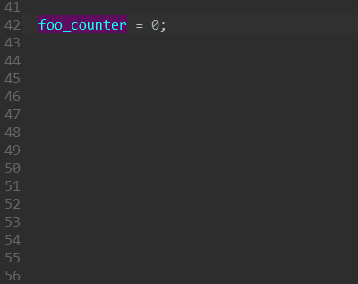

# Uncertaintifier

Celebrating uncertainty as an essential part of life, this IDA plugin lets you uncertaintify (or, add trailing question marks to) the names of local variables in the pseudocode view.

## FAQ

### How to install?
Simply put the Python file in `%APPDATA%\Hex-Rays\IDA Pro\plugins`. Both Python 2 and 3 are supported.

### How do I register just the plugin's hotkeys, without the context menu items?
In the plugin's source code, change the value of `REGISTER_CONTEXT_MENU_ITEMS` to `False`.

### Why does this plugin exist?
Without delving too deep into the philosophical niche of plugin existentialism, this plugin has been written because starting with version 7.5, Hex-Rays will complain if a local variable name is "not a valid C identifier", thus prohibiting names containing question marks.

Inspired by a friend's idea, _Uncertaintifier_ amends this situation.
